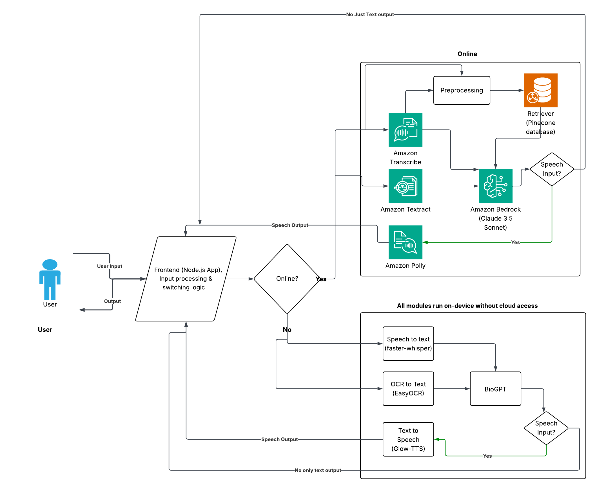

# 🏥 Medical LLM App (Voice/Text Input with Online/Offline Modes)

This is a powerful and privacy-conscious medical assistant app that uses both **cloud-based** and **offline** AI models to answer user questions via voice or text. The app supports **Hindi and English** output, uses **Claude 3.5 via AWS Bedrock** for high-quality online answers, and falls back to **BioGPT + offline TTS/STT** for offline use.

---

## ✅ How It Works (Working First)

- The app accepts **voice or text input** and returns responses via **voice (TTS)** or **text**.
- With an **internet connection**, it uses:
  - 🎙️ **OpenAI Whisper** (STT)
  - 🤖 **Claude 3.5 via AWS Bedrock** for responses
  - 📚 **RAG** (Retrieval Augmented Generation) with **Pinecone**
  - 🗣️ **Amazon Polly** for voice output
  - 📝 **Textract & Translate** (for OCR and multilingual support)

- Without internet, it runs **completely offline** using:
  - 🧠 **BioGPT (Q5_K_M GGUF)** for LLM responses
  - 🧾 **easyOCR** (OCR)
  - 🗣️ **Glow-TTS** (TTS)
  - 🧏‍♂️ **faster-whisper-base.en** (STT)

- The system:
  - Uses **chat history** as part of the context to improve response quality.
  - Saves conversations locally by **session**.
  - Can analyze **uploaded files or images** (OCR + language detection + summarization).
  - Automatically chooses online or offline mode depending on connectivity.

---

## 🏗️ Architecture Overview



## 🛠️ Technologies Used

| Area         | Online Tools                              | Offline Tools                             |
|--------------|-------------------------------------------|-------------------------------------------|
| LLM          | Claude 3.5 (AWS Bedrock)                  | BioGPT (Q5_K_M, GGUF via llama.cpp)       |
| STT          | OpenAI Whisper API                        | faster-whisper-base.en                    |
| TTS          | Amazon Polly                              | Glow-TTS                                  |
| OCR          | AWS Textract                              | easyOCR                                   |
| RAG          | Pinecone (Free Tier)                      | Local fallback context only               |
| Language     | AWS Translate / Langdetect                | Langdetect                                 |
| Chat History | File-based JSON session storage           | Same                                       |
| API Backend  | Flask + CORS                              | Flask                                      |
| Frontend     | React (Voice UI, file input, etc.)        | Same                                       |

---

## 📦 Datasets Used for RAG

The vector search backend is populated using the following medical QA datasets:

1. **PubMedQA** (`qiaojin/PubMedQA`)
   - Both `pqa_labeled` and `pqa_unlabeled` versions
   - Used `final_decision`, `context`, and `long_answer` fields

2. **MedQuad** (`keivalya/MedQuad-MedicalQnADataset`)
   - Includes curated question-answer pairs from multiple medical sources

### Embedding Model
- `all-MiniLM-L6-v2` via Hugging Face
- Sentences chunked, embedded, and upserted into Pinecone vector DB

---

## 🧠 Model Metadata (YAML in Markdown)

```yaml
license: apache-2.0
tags:
  - medical
  - RAG
  - offline
  - whisper
  - bedrock
  - biogpt
  - TTS
  - STT
  - Hindi
datasets:
  - qiaojin/PubMedQA
  - keivalya/MedQuad-MedicalQnADataset
language:
  - en
  - hi
model:
  - BioGPT Q5_K_M GGUF
  - Claude 3.5 (Bedrock)
  - all-MiniLM-L6-v2 (embeddings)
stt:
  - OpenAI Whisper API
  - faster-whisper-base.en
tts:
  - Amazon Polly
  - Glow-TTS
ocr:
  - AWS Textract
  - easyOCR
vector_store:
  - Pinecone (free-tier)
api:
  - Flask (backend)
  - React (frontend)
```

---

## 🚀 Installation & Setup

### 📁 1. Clone the Repository

```bash
git clone https://github.com/PranavShashidhara/MediAssist_AI.git
```

### 🧱 2. Set Up Python Environment (Backend)

```bash
cd backend
python -m venv venv
source venv/bin/activate  # On Windows: venv\Scripts\activate
pip install -r requirements.txt
```

### 🌐 3. Configure Environment Variables

Create a `.env` file in the `backend/` directory with the following content:

```ini
PINECONE_API_KEY=your-pinecone-key
OPENAI_API_KEY=your-openai-key
HF_TOKEN=your-hugging-face-key
```

💡 For offline mode, you can leave API keys blank — the system will switch to local models automatically.

### 🧠 4. Download Local Models (For Offline Mode)

Ensure the following are downloaded and placed correctly:
* 🧠 **BioGPT Q5_K_M GGUF** in a folder like `models/biogpt`
* 🧏‍♂️ **faster-whisper-base.en** (STT model)
* 🗣️ **Glow-TTS** for offline text-to-speech

These models may auto-download on first use, but pre-downloading improves performance.

### 🧪 5. Run Backend Server

```bash
cd aws_medical_llm
python main.py
```

This starts your Flask backend on `http://localhost:5000`.

### 🎛️ 6. Frontend Setup (React)

```bash
cd my-chat-app
npm install
npm start
```

This runs the React app at `http://localhost:3000`.

---

## 🧪 How to Use

* Open the app in your browser.
* With internet: ask questions via voice or text in English or Hindi.
* Without internet: disconnect Wi-Fi, and the app automatically switches to offline mode.
* Upload medical images or prescriptions for OCR + question-answering.
* All sessions are stored locally for review or debugging.

---

## 🙌 Acknowledgments

* AWS Bedrock
* Hugging Face
* Pinecone
* Microsoft BioGPT
* Glow-TTS
* Faster-Whisper
* Textract

---

